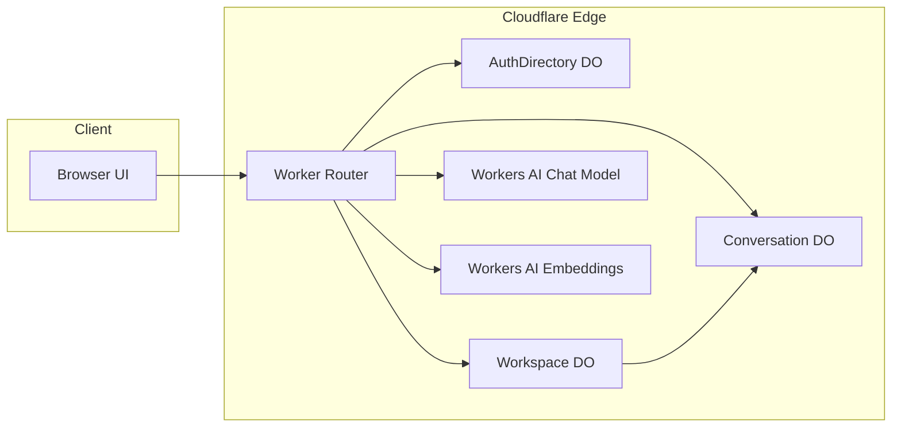
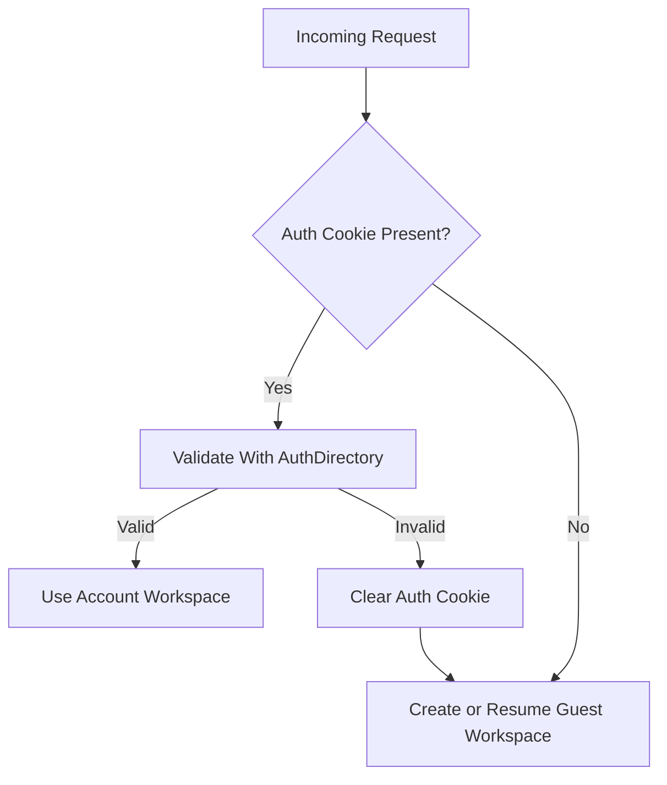
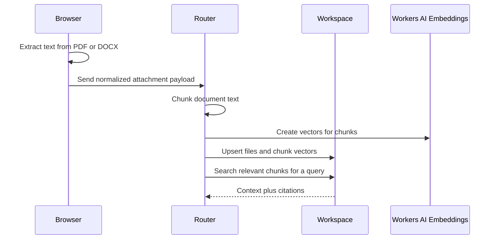
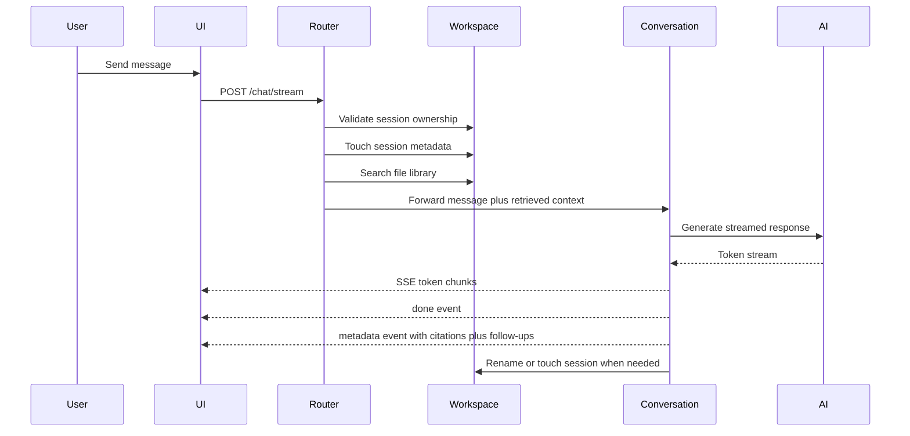

# LYTA Architecture

This document explains how LYTA is structured and why the main design choices were made.

## Visual Architecture

  

## Design Goals

LYTA was built around a few explicit goals:

- make chat state isolation real, not implied
- support both guest usage and account-backed persistence
- treat uploaded files as reusable knowledge, not one-shot attachments
- keep the architecture small enough to understand end-to-end
- make the project presentable as a serious engineering portfolio repo

## High-Level System

## Durable Object Responsibilities

### `AuthDirectory`

Purpose:

- store account records
- create and validate auth sessions
- isolate password and session logic from the rest of the app

Why:

- account state has different lifecycle and sensitivity than chat state
- centralizing auth avoids duplicating session logic across workspaces

### `Workspace`

Purpose:

- store one workspace's profile and preferences
- maintain the workspace chat list
- store reusable uploaded files
- store searchable document chunks and vectors

Why:

- workspace-level state is a separate concern from conversation memory
- this is the right boundary for guest mode and account mode alike
- file memory naturally belongs to the workspace, not a single chat

### `Conversation`

Purpose:

- manage one chat's recent messages
- generate short titles
- summarize older context
- persist streamed replies, citations, and follow-ups

Why:

- one chat per Durable Object creates clean state isolation
- ordered execution matters for streaming and persistence correctness

## Principal Resolution Model

LYTA supports two workspace entry modes.

### Guest Mode

- no login required
- backed by a temporary guest cookie
- still uses a real server-side workspace
- good for trial, demo, or low-friction access

### Account Mode

- authenticated through `AuthDirectory`
- mapped to a private user workspace
- retains chats, library files, theme, and profile settings

This model gives low-friction onboarding without sacrificing clean user isolation.

## File and Retrieval Pipeline

### Why Parsing Starts In The Browser

Benefits:

- keeps the Worker runtime simpler
- avoids adding a separate ingestion service
- reduces server-side file parsing complexity

Tradeoff:

- OCR is not included yet, so scanned PDFs still need a future pipeline

### Why Retrieval Lives At The Router Layer

The router is the correct orchestrator because it can:

- resolve the current principal
- access the correct workspace
- import new attachments into the workspace library
- run library search before the conversation request
- forward enriched context to the chat Durable Object

That keeps the `Conversation` Durable Object focused on conversation behavior, not cross-service coordination.

## Chat Request Lifecycle

## Frontend Structure

The frontend is intentionally framework-free.

Main responsibilities in `pages/app.js`:

- bootstrap the current workspace
- maintain current session state
- manage uploads and attachment previews
- stream assistant responses
- render citations and follow-up prompts
- manage guest versus account mode UI
- manage profile, theme, and library drawers
- manage the output board

Why this is useful for the project:

- easier to understand in a portfolio setting
- fewer moving parts for a small but serious product
- keeps the architecture emphasis on system design rather than framework ceremony

## Output Board Philosophy

The board is not a side gimmick. It exists because chat alone is often a poor final surface for useful work.

The board gives LYTA:

- a clearer artifact-reading surface
- fast copy and export behavior
- a more product-like feeling than a pure message list

This is one of the more distinctive parts of the project because it moves the app away from "just another chatbot clone."

## Security and Isolation Notes

- account sessions are stored as hashed tokens
- password hashing uses PBKDF2
- guest and account workspaces are isolated by different workspace keys
- each conversation Durable Object is scoped to one workspace key plus one session id

This is compact, but it still demonstrates responsible state partitioning.

## Engineering Challenges

- maintaining state correctness while streaming assistant replies
- isolating guest and account data without duplicating product logic
- keeping file memory reusable across chats without a separate vector database
- preserving deterministic chat ordering under concurrent requests
- making the system explainable enough to review end-to-end

## Current Tradeoffs

- guest workspaces are temporary by design
- email/password auth is simpler than production OAuth
- retrieval storage inside the workspace DO is great for clarity, but not the final answer for very large file libraries
- static built-in knowledge retrieval is intentionally lightweight

## What I Would Evolve Next

If LYTA continued beyond portfolio scope, the next major upgrades would likely be:

- OCR for scanned files
- external vector search for larger library scale
- OAuth or magic-link auth
- web-grounded research mode
- shareable outputs and published artifacts
- stronger observability around retrieval quality and latency
