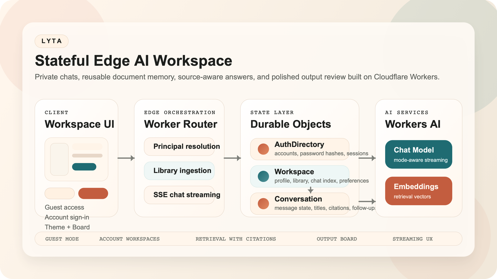
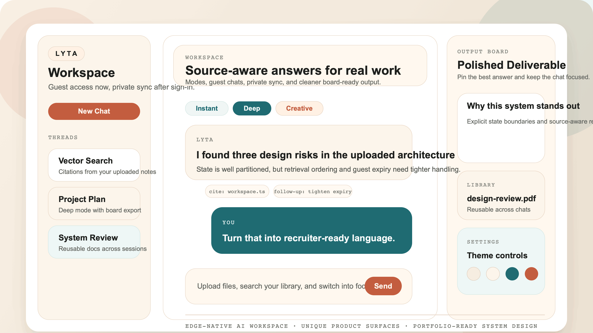
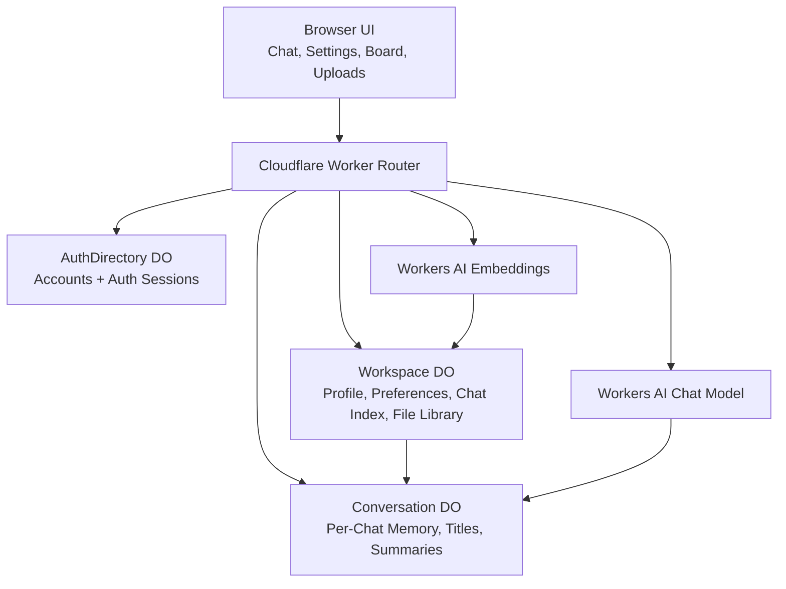
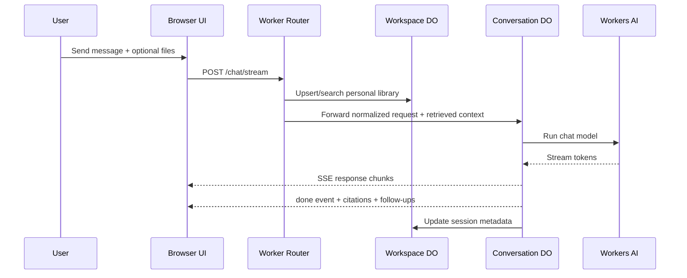

# LYTA


<p align="center">
  
</p>

<p align="center">
  <b>Stateful Edge AI Workspace built on Cloudflare Workers</b><br/>
  Session-based memory · Streaming responses · Retrieval with citations
</p>

<p align="center">
  <a href="https://lyta.parthrohit-dev.workers.dev"><b>Live Demo</b></a> ·
  <a href="./ARCHITECTURE.md"><b>Architecture Notes</b></a>
</p>

## Overview

LYTA is a production-oriented AI system focused on system design, not just chat UI.

Core capabilities:

- instant guest usage with temporary server-backed chats
- account-backed private workspaces for persistent chats, files, and preferences
- reusable document memory across conversations
- citation-aware answers from uploaded files
- streaming responses with `Instant`, `Deep`, and `Creative` modes
- smart follow-up prompts and a dedicated output board for polished deliverables

The project is designed to show how an AI assistant can be built as a real edge product with isolated state, retrieval, streaming, and a product layer that feels intentional instead of cloned.

## Preview

<p align="center">
  
</p>

## Why This Project Matters

Most AI demos stop at "send prompt, render response." LYTA goes further:

- state is modeled explicitly with Durable Objects
- guests can try the product immediately without losing clean isolation
- signed-in users get private account-backed workspaces
- files become reusable retrieval context instead of one-off attachments
- citations and follow-up prompts are part of the core product behavior
- the output board creates a second surface for useful deliverables

This makes LYTA a stronger showcase for AI engineer and software engineer roles because it demonstrates system design, product thinking, and implementation discipline together.

## Live Demo

Production URL:

`https://lyta.parthrohit-dev.workers.dev`

Suggested walkthrough:

1. Open the app as a guest and create a temporary chat.
2. Upload a PDF or DOCX and ask a question about it.
3. Reuse the same file from the library in a new thread.
4. Switch between `Instant`, `Deep`, and `Creative`.
5. Pin an answer to the output board.
6. Sign in and confirm private workspace persistence.

## Engineering Challenges

- Maintaining consistent session state across edge environments
- Designing isolated memory per workspace and per conversation
- Handling streaming responses without partial state corruption
- Integrating retrieval without external vector infrastructure
- Ensuring deterministic behavior under concurrent requests

## Feature Set

### Workspace Modes

- guest workspaces with temporary server-backed storage
- account workspaces with private persisted chats, files, and preferences
- a compact auth modal instead of a forced landing page

### Chat Experience

- Server-Sent Event streaming
- `Instant`, `Deep`, and `Creative` response modes
- short 2-3 word chat title generation
- smart follow-up suggestions after each answer
- typing indicator lifecycle that ends cleanly when streaming finishes

### Files and Retrieval

- image upload support
- PDF, DOCX, TXT, MD, CSV, JSON, HTML, and XML ingestion
- reusable personal file library
- document chunking plus embeddings for retrieval
- source citations rendered in chat and on the board

### UI and Product Layer

- minimal workspace-first interface
- profile, theme, and library controls in a dedicated settings drawer
- per-surface theme customization
- focus mode to hide the chat list and expand the conversation view
- output board for cleaner reading, copying, and export

## Architecture

### Visual Architecture

<p align="center">
  
</p>

### System Diagram



### Request Flow



### Core Building Blocks

| Layer | Responsibility |
| --- | --- |
| `pages/app.js` | Auth modal, chat UX, uploads, streaming UI, settings drawer, output board |
| `src/router.ts` | Principal resolution, auth orchestration, guest/account routing, retrieval orchestration |
| `AuthDirectory` | Account records, hashed password handling, session validation |
| `Workspace` | Profile, theme prefs, chat list, reusable library, library search |
| `Conversation` | Per-chat memory, title generation, summarization, follow-ups, stream persistence |
| `Workers AI` | Response generation and embedding creation |

More implementation detail lives in [ARCHITECTURE.md](./ARCHITECTURE.md).

## Technical Choices

### Durable Objects For Stateful Boundaries

LYTA uses Durable Objects where strong consistency matters:

- `AuthDirectory` for account auth
- `Workspace` for per-user or per-guest workspace state
- `Conversation` for per-chat memory and ordered writes

This keeps account state, workspace state, and conversation state separate.

### Browser Parsing Plus Server Retrieval

The browser extracts readable text from supported documents before upload. The Worker then:

- chunks text
- creates embeddings
- stores reusable file metadata in the workspace
- retrieves matching snippets for future chat requests

That keeps the architecture compact while still demonstrating real retrieval behavior.

### Guest-First Access Without Weak Isolation

Users can start immediately without authentication. When they sign in, the app switches to an account-backed workspace with private persistent storage. This preserves low-friction access while keeping clean ownership boundaries in the backend.

### Output Board Instead Of Chat-Only UX

The output board is intentional product design, not decoration. It gives LYTA a second surface for deliverables so answers can be reviewed, copied, or exported outside the raw chat stream.

## Project Structure

```text
assets/
  architecture.png         README banner and architecture visual
  architecture.svg         Source for the architecture visual
  demo.gif                 README preview asset
  demo.png                 High-resolution preview still
  demo.svg                 Source for the preview visual

scripts/
  render_asset.swift       Regenerates README raster assets from local SVG sources

pages/
  index.html               Main UI shell
  styles.css               Visual system and responsive layout
  app-core.js              Generated browser utility bundle
  app-attachments.js       Attachment preparation in the browser
  app.js                   Client logic for chat, auth, uploads, board, settings

pages-src/
  app-core.ts              TypeScript source for app-core.js during frontend migration

src/
  index.ts                 Worker entry
  router.ts                Request orchestration and workspace routing
  auth/crypto.ts           Password and token helpers
  chat/messages.ts         Prompt shaping and message normalization
  durable/
    authDirectory.ts       Account and session storage
    workspace.ts           Workspace state, file library, preferences
    conversation.ts        Chat memory, streaming, follow-ups, summaries
  library/chunks.ts        Document chunking and citation formatting
  services/
    ai.ts                  Workers AI model calls
    embeddings.ts          Embedding generation
    retriever.ts           Small built-in knowledge retriever
```

## Stack

- Cloudflare Workers
- Cloudflare Durable Objects
- Cloudflare Workers AI
- TypeScript
- Vanilla HTML, CSS, and browser JavaScript
- Incremental frontend TypeScript migration with generated assets in `pages/`
- PDF.js
- Mammoth
- Server-Sent Events

## Local Development

### Requirements

- Node.js 18+
- Wrangler CLI

### Install

```bash
npm install
```

### Build Client Assets

If you change files under `pages-src/`, rebuild the generated browser assets before running or deploying:

```bash
npm run build:client
```

### Run

```bash
wrangler dev --remote
```

Open:

`http://localhost:8787`

## Verification

Current lightweight checks:

```bash
npm run build:client
node --check pages/app-core.js
node --check pages/app.js
node --check pages/app-attachments.js
./node_modules/.bin/tsc --noEmit
```

## Tradeoffs

- guest mode is intentionally temporary and session-scoped
- auth is currently email/password based, not OAuth
- library retrieval stays inside the workspace Durable Object for clarity and smaller project scope
- OCR and web-grounded research are still natural next steps

## Roadmap Ideas

- shareable artifacts or published pages
- OCR for scanned PDFs and images
- research mode with explicit web citations
- richer artifact generation beyond markdown output
- OAuth or magic-link authentication
- stronger observability around retrieval quality and latency

## Repo Quality Goals

This repo is intentionally structured to read well for reviewers:

- clean separation of product layers and system layers
- architecture decisions explained in writing
- diagrams that map directly to implementation
- a live demo that reflects the shipped product
